### Deploying Umbrella roaming client with Autotask Endpoint Manager (AEM)
<div>
<table style="height: 50px; width: 100%">
	<tbody>
		<tr>
			<td bgcolor="#ffffcc">
				<p> This guide is meant to be a basic overview of deploying the Cisco Umbrella roaming client using your RMM tool. We are not able to provide comprehensive support for AEM, but there is  <a href="http://help.aem.autotask.net/en/Content/4FEATURESPORTAL/Components/Scripting.htm">further documentation</a> available related to Components in AEM.</p>
			</td>
		</tr>
	</tbody>
</table>
</div>
<div>
<table style="height: 100px; width: 100%">
	<tbody>
		<tr>
			<td bgcolor="#ffffcc">
				<p><strong>NOTE:</strong> This document is specific to deploying the Umbrella roaming client on Windows client operating systems, such as Windows 8 or 10. We do not support the installation of the Umbrella roaming client on Windows Server operating systems. A list of prerequisites is available <a href="https://docs.umbrella.com/product/msp/prerequisites/">here</a>. This document assumes you've read these prerequisites and have opened the appropriate firewall ports</p>
			</td>
		</tr>
	</tbody>
</table>
</div>

AEM provides the ability to use ```Components``` to deploy software or perform tasks. Components are essentially scripts in various languages (sometimes with environment variables) used in ```Jobs``` to run on the endpoints. The component available for download <a href="https://github.com/opendns/Deploy-Scripts/raw/master/AEM/DeployUmbrellaRoamingClient.cpt">here</a> is a PowerShell script with environment variables.

<div>
<table style="align:center"><colgroup><col width="624" /></colgroup>
	<tbody>
		<tr>
			<td bgcolor="#ccffff">You must enter all customer internal domains before deploying the Umbrella roaming client. Failure to do so will cause problems with accessing internal resources. To do this, in the Umbrella dashboard, navigate to Settings > Internal Domains and enter domains as required. For details about what needs to be in this list, please see please see <a href="https://docs.umbrella.com/product/msp/appendix-d-internal-domains/">this support article</a>.
			</td>
		</tr>
	</tbody>
</table>
</div>

In the AEM dashboard, click on **Components** and then **Import Component** to upload the script downloaded from <a href="https://github.com/opendns/Deploy-Scripts/raw/master/AEM/DeployUmbrellaRoamingClient.cpt">here</a>. 

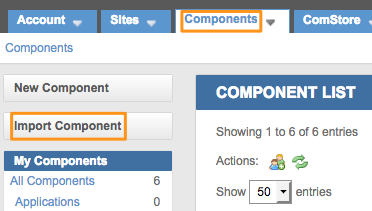

Next, select the component you just downloaded and click **Upload**:

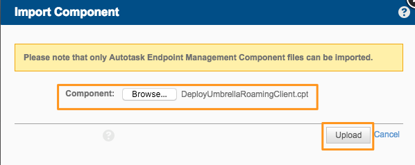

Finally, click **Save** after confirming the script has successfully imported:

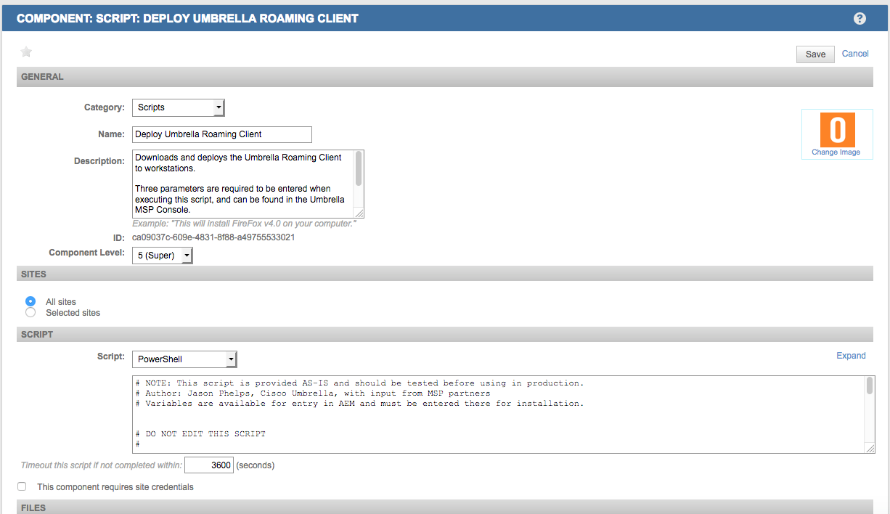

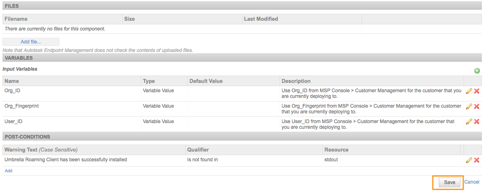

**Note:** There is no need to edit the script parameters, etc.

In your AEM Portal, you will see the top navigation menu where you will select the devices you wish to deploy the roaming client to. __Note that you are only able to deploy to a single customer at a time__. 

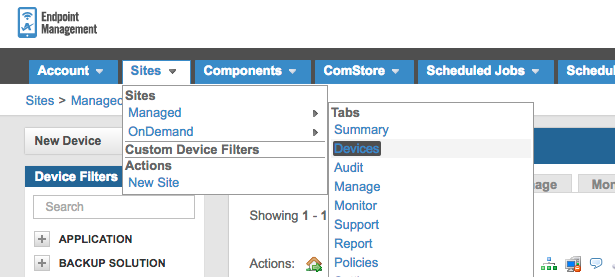


Once you have selected the appropriate devices, schedule a Job to run: 

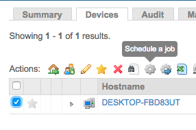

You will then be prompted for a Job name, Component to add and any alerting options you want to configure. First, choose the name for the Job and when you want to schedule the Job to run. Then, click ```Add a Component```.

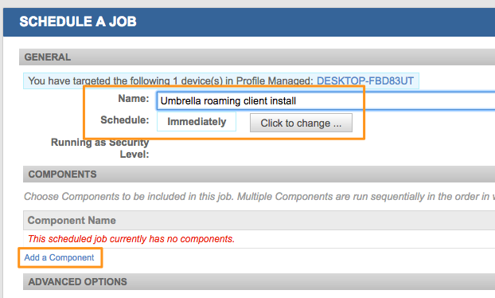

Now, select the ```Deploy Umbrella roaming client``` component and click ```Add```.

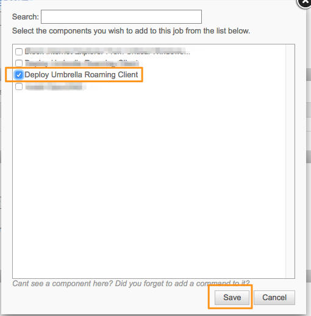

Now that you've added the Component, you will see a section for Variables. This is what associates the roaming client with the correct customer organization. In the MSP Console, you can find the  ```User_ID```, ```Org_ID``` and ```Org_Fingerprint``` parameters by navigating to Customer Management and expanding a customer.

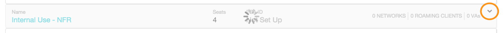

Parameters are located in the _Deployment Parameters_ area. 

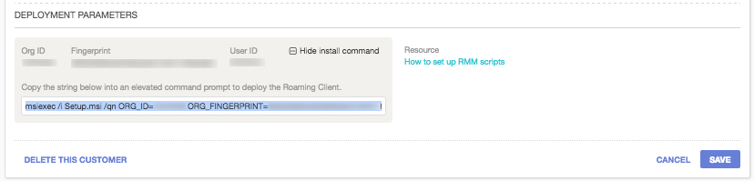

Copy the appropriate variables into the fields as shown below.

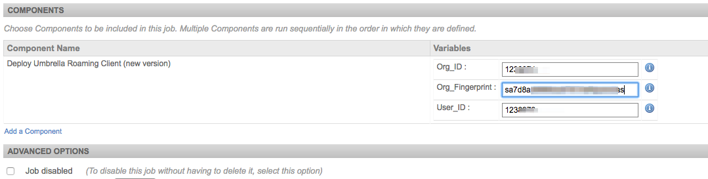

The rest of the Job page is optional, but if you want alerts with logs emailed to you, you can use the Alerts + Job Recipients section to do so:

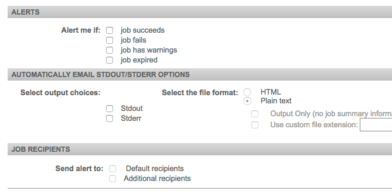

To review results, click on the Job name and view the status as shown below. 

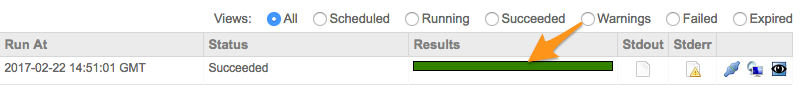

A successful install will show the following ```Stdout``` output:

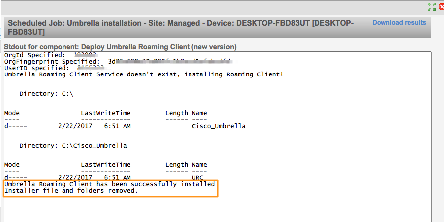

In this example, we see a failed job and the logs from the script are in the ```Stdout``` output.

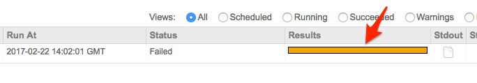

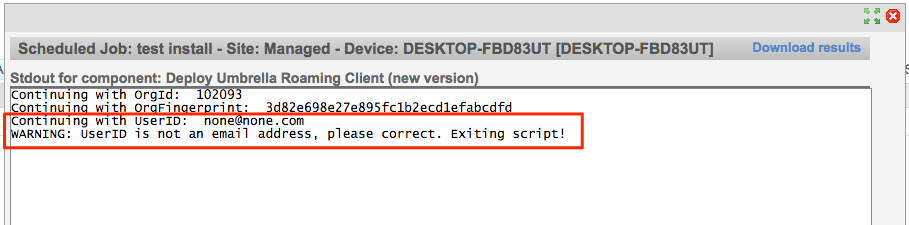

Another example:

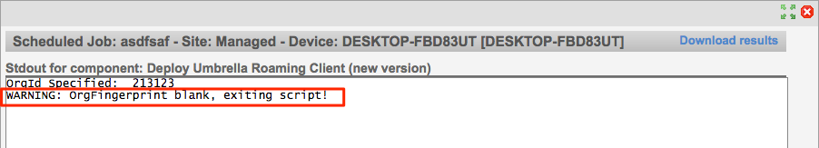

To confirm the roaming client is checking in, log into your Umbrella Dashboard and choose the customer where you ran the deployment script. Navigate to Identities > Roaming Computers, and search for the individual host names where the script should have been run.  If the computer is checking in properly, you’ll notice a green status icon as shown below:  

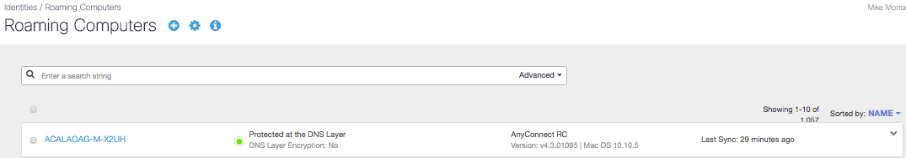


Computers without a green status icon are not checking in properly with Umbrella.  Please check [this support article](https://docs.umbrella.com/product/msp/appendix-a-status-and-functionality/) for more information on the status icons and troubleshooting.
