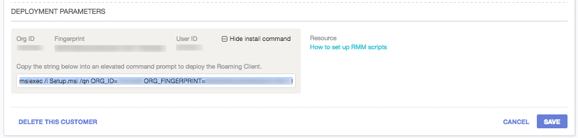

###Deploying OpenDNS Umbrella Roaming Client with Continuum
<div>
<table style="height: 50px; width: 100%">
	<tbody>
		<tr>
			<td bgcolor="#ffffcc">
				<p> This guide is meant to be a basic overview of deploying the OpenDNS Umbrella Roaming Client using your RMM tool.  OpenDNS is not able to provide comprehensive support for Continuum, but there is <a href="https://doccenter.itsupport247.net/">further documentation</a> available related to Scripts in Continuum.</p>
			</td>
		</tr>
	</tbody>
</table>
</div>
<div>
<table style="height: 100px; width: 100%">
	<tbody>
		<tr>
			<td bgcolor="#ffffcc">
				<p><strong>NOTE:</strong> This document is specific to deploying the OpenDNS Roaming Client on Windows client operating systems,  such as Windows 8 or 10. OpenDNS does not support the installation of the Roaming Client on Windows Server operating systems. A complete list of prerequisites are available <a href="https://docs.opendns.com/product/msp/prerequisites/">here</a>. This document assumes you've read these prerequisistes and have opened the appropriate firewall ports</p>
			</td>
		</tr>
	</tbody>
</table>
</div>
Continuum provides the ability to create script templates to deploy products that are not built-in to Continuum’s RMM tool.  This document provides the instructions to configure a template  to deploy the OpenDNS Roaming Client to your customer's computers. We recommend creating a deployment script for each individual customer with a naming convention such as %Client Name% OpenDNS Client Deployment. This will allow easy deployment to customers in the future and allow scheduling of installs.

<div>
<table style="align:center"><colgroup><col width="624" /></colgroup>
	<tbody>
		<tr>
			<td bgcolor="#ccffff">Please note that all customer Internal Domains must be entered first before deploying the Roaming Client.  Failure to do so will cause problems with accessing internal resources. This is done in the Dashboard by navigating to Configuration > System Settings > Internal Domains. For details about what needs to be in this list, please see <a href="https://docs.opendns.com/product/msp/appendix-d-internal-domains/">this support article</a>.
			</td>
		</tr>
	</tbody>
</table>
</div>

Once logged into your Continuum Portal, you will see the top navigation menu where you will select “Scripts” as shown below.  On the left navigation column, click on “Essentials” and then choose “Templates” as shown in the image below.


<table style="width:100%">
	<tbody>
		<tr>
			<td>
				 Manage Scripts">
			</td>
		</tr>
	</tbody>
</table>

Once in the  Template section, you will need to search or browse to the option "Create own application."  As shown below, click the radio button next to this option and then click the "Create a Script From This Template" button above. 

<table>
	<tbody>
		<tr>
			<td>
				
			</td>
		</tr>
	</tbody>
</table>

Here you can define your own installer which we’ll use to deploy the Umbrella Roaming Client.  There is a specific install string that is required for the script to ensure that your roaming clients check in with the correct customer Dashboard.  

You can find the install string in the OpenDNS MSP Console by expanding the Customer Management card (circled below) and clicking "show install string."  Then, select the string beginning with ````/qn ORG_ID= ```` through the end.

<table>
	<tbody>
		<tr>
			<td>
				
			</td>
		</tr>
	</tbody>
</table>


<table style="align:center"><colgroup><col width="624" /></colgroup>
	<tbody>
		<tr>
			<td>
				
			</td>
		</tr>
  </tbody>
</table>


The install string uses three parameters to register the Roaming Client in the correct Dashboard. Those parameters are ```USER_ID```,  ```ORG_ID``` and ```ORG_FINGERPRINT``` (see screenshot above).  Note that the ```msiexec /i Setup.msi``` portion of the install string is not necessary in Continuum, and will cause errors.

More detail about the parameters and their definitions can be found in <a href="https://docs.opendns.com/product/msp/automated-deployment/#section-deployment-parameters">this support article</a>.

---

First, we’ll create the installer.  To start, click “Create a Script From the Template.”  You will see a screen similar to the one below: 

<table style="width:100%">
	<tbody>
		<tr>
			<td>
				
			</td>
		</tr>
	</tbody>
</table>

Make the following changes:

__Script Name__: *%Customer Name%* OpenDNS Roaming Client Deployment

__Script Description__:  Installation script for the Umbrella Roaming Client for *%Customer Name%*

###“Download Details” Section
Location:
```
http://shared.opendns.com/roaming/enterprise/release/win/production/
```

_Note that this URL does not work in a browser unless you include the filename ```Setup.msi```in the URL. This location tells Continuum where to look for the file, and below we'll be setting the filename._
###“Application Details” Section

Type of Application: 
```MSI Package```

Package/Exe name: 
```Setup.msi ```  __(note this is case-sensitive)__

Installation Parameter: __Use string from Customer Management shown below__

<table style="align:center"><colgroup><col width="624" /></colgroup>
	<tbody>
		<tr>
			<td>
				
			</td>
		</tr>
  </tbody>
</table>

<table style="height: 70px; width: 100%">
	<tbody>
		<tr>
			<td bgcolor="#ffffcc">
				<strong>NOTE:</strong> If you want a visible installation, you can change the HIDE_UI and HIDE_ARP to 0 instead of 1; more details about this and the other variables are available in <a href="https://docs.opendns.com/product/msp/automated-deployment/#section-deployment-parameters">this support article</a>.
			</td>
		</tr>
	</tbody>
</table>


MD5 Checksum: 
```
Leave this blank
```

Install under user account: 
```
Leave this unchecked
```

Execution Mode:
```
Set this to Install
```


After you have completed the required section and any optional sections, click the `Update` or `Save` button to save the settings you have changed, and then you’ll be returned to your list of partner applications.


- - -


Now that you’ve created this script template, you can create a job using this template to deploy the Roaming Client. OpenDNS recommends testing your script on a single machine to verify it works as expected before deploying to a large group. In the Scripts Home, click Essentials > Jobs and Instances.  Then, click ```Add Job```. Set the "Job Name” (1). Click on the radio button next to "Script" (2). Click on the arrows (3) and start to type the name of the script you created in the "Filter" section then click on the script template you created, as in the image below:

<table style="width:100%">
	<tbody>
		<tr>
			<td>
				 Third Party Applications" style="vertical-align:middle">
			</td>
		</tr>
	</tbody>
</table>

You also have the option to receive an email alert from Continuum with summary information about the Job you have scheduled. 

<table style="width:100%">
	<tbody>
		<tr>
			<td>
				 Third Party Applications" style="vertical-align:middle">
			</td>
		</tr>
	</tbody>
</table>

Use the drop down menus to choose 'Sites,' 'Desktops' and the location you are deploying to:  

<table style="width:100%">
	<tbody>
		<tr>
			<td>
				
			</td>
		</tr>
	</tbody>
</table>

Then, choose the scheduled time to run the script, or execute immediately.
<table style="width:100%">
	<tbody>
		<tr>
			<td>
				
			</td>
		</tr>
	</tbody>
</table>

To confirm the Roaming Client is checking in, log into your OpenDNS Dashboard and navigate to Configuration > Identities > Roaming Computers.  Look for the customer where you ran the deployment script, and search for the individual host names where the script should have been run.  If the computer is checking in properly, you’ll notice a green status icon as shown below:  

<table style="width:100%">
	<tbody>
		<tr>
			<td>
				
			</td>
		</tr>
	</tbody>
</table>

Computers without a green status icon are not checking in properly with OpenDNS.  Please check [this support article](https://docs.opendns.com/product/msp/appendix-a-status-and-functionality/) for more information on the status icons and troubleshooting.
