###Deploying OpenDNS Umbrella Roaming Client with Continuum
<div>
<table style="height: 100px; width: 100%">
	<tbody>
		<tr>
			<td bgcolor="#ffffcc">
				<p><strong>NOTE:</strong> This document is specific to deploying the OpenDNS Roaming Client on 	Windows client operating systems,  such as Windows 7. OpenDNS does not support the installation of the Roaming Client on Windows Server operating systems as it has not been tested and is not supported.</p>
			</td>
		</tr>
	</tbody>
</table>
</div>


Continuum provides the ability to define a “Partner Application” to deploy products that are not explicitly built-in to Continuum’s RMM tool.  This document provides the instructions to configure a Partner Application in Continuum to deploy the Roaming Client to your customer's computers.  Please note that this guide is meant to be a basic overview of deploying the OpenDNS Umbrella Roaming Client using your RMM tool.  OpenDNS is not able to provide comprehensive support for Continuum, but there is <a href="http://continuum.helpdocsonline.com/#application-scripts">further documentation</a> available related to partner applications in Continuum. 

<div>
<table style="align:center"><colgroup><col width="624" /></colgroup>
	<tbody>
		<tr>
			<td bgcolor="#ccffff">This document assumes that you have read the prerequisites for the Roaming Client and all necessary firewall ports have been opened as documented in <a href="https://support.opendns.com/entries/22198613">this support article.</a>.  Please note that all customer Internal Domains must be entered first before deploying the Roaming Client.  Failure to do so will cause problems with accessing internal resources. This is done in the Dashboard by navigating to Configuration > System Settings > Internal Domains (Roaming). For details about what needs to be in this list, please see <a href="https://support.opendns.com/entries/22365052">this support article</a>.
			</td>
		</tr>
	</tbody>
</table>
</div>

Once logged into your Continuum Portal, you will see the top navigation menu, where you will select “Scripts” as shown below.  Then, on the left navigation column, click on “Manage Scripts” and then you can choose “Application” as shown in the image below.


<table style="width:100%">
	<tbody>
		<tr>
			<td>
				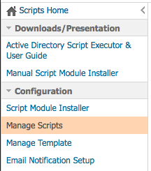 Manage Scripts">
			</td>
			<td>
				 Application">
			</td>
		</tr>
	</tbody>
</table>

Once in the Application section, on the far right you will see “Continuum Applications” and “Partner Application Installers.”  As shown below, click on Partner Application Installers. 

<table>
	<tbody>
		<tr>
			<td>
				
			</td>
		</tr>
	</tbody>
</table>

This screen provides you the ability to define your own installer which we’ll use to deploy the Umbrella Roaming Client.  There is a specific install string that is required for the script to ensure that your roaming clients check in with the correct customer Dashboard.  

<div>
<table style="height: 100px; width: 100%">
	<tbody>
		<tr>
			<td bgcolor="#ffffcc">
				<p><strong>NOTE:</strong> The install string can be found in the OpenDNS MSP Console by clicking on Roaming > Deploy and click the download link (circled below in blue) to export the list of customers with the installation parameters.  The generated CSV includes the install string that is used below in the "Application Details" section.  </p>
			</td>
		</tr>
	</tbody>
</table>
</div>


The install string uses three parameters to register the Roaming Client in the correct Dashboard. Those parameters are ORG_ID, ORG_FINGERPRINT, USER_ID, HIDE_ARP, and HIDE_UI (see screenshot). 

<table style="width:100%">
	<tbody>
		<tr>
			<td>
				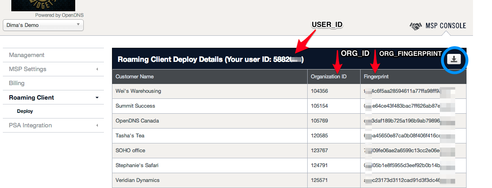
			</td>
		</tr>
	</tbody>
</table>

More detail about the parameters and their definitions can be found in <a href="https://support.opendns.com/entries/55881150-Roaming-Client-Deployment-Parameters-MSP-Partners">this support article</a>.

First, we’ll create the installer.  To start, click “Create Application Installer.”  You will see a screen similar to the one below: 

<table style="width:100%">
	<tbody>
		<tr>
			<td>
				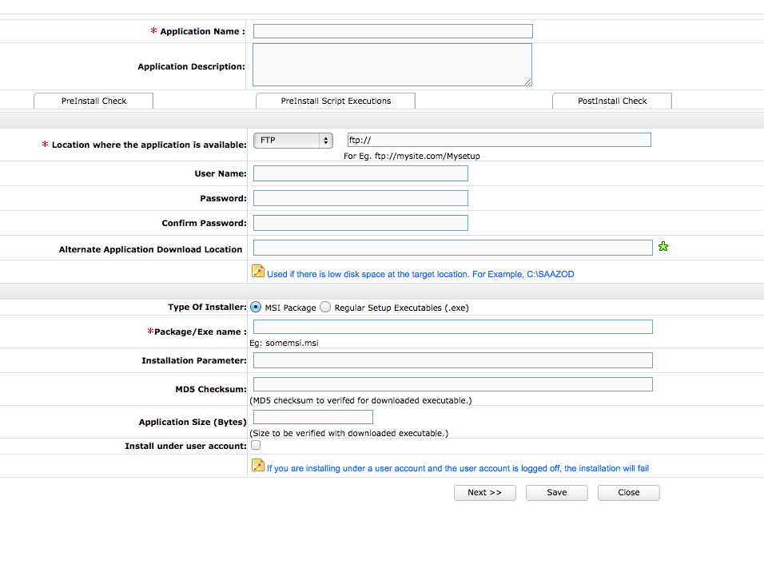
			</td>
		</tr>
	</tbody>
</table>

Make the following changes:

__Application Name__: *OpenDNS Umbrella Roaming Client Installer*

__Application Description__:  *Installation script for the Umbrella Roaming Client*

###“Application Details” Tab
Location where the application is available:
```
http://shared.opendns.com/roaming/enterprise/release/win/production/
```

Alternate Application Download Location:  
```
leave this blank
```

Type of Installer:
```
MSI Package
```

Package/Exe name: 
```
Setup.msi (note this is case-sensitive)
```   


Installation Parameter: 

```
/qn ORG_ID=org_id ORG_FINGERPRINT=org_fingerprint USER_ID=user_id HIDE_UI=1 HIDE_ARP=1
```
<table style="height: 70px; width: 100%">
	<tbody>
		<tr>
			<td bgcolor="#ffffcc">
				<strong>NOTE:</strong> If you are using the install string from the exported CSV file, be sure to remove <i><u>msiexec /i Setup.msi</i></u> when pasting. <p>If you want a visible install, you can change the HIDE_UI and HIDE_ARP to 0 instead of 1; more details about this and the other variables are available in <a href="https://support.opendns.com/entries/55881150-Roaming-Client-Deployment-Parameters-for-mass-deployment-MSP-">this support article</a>.
			</td>
		</tr>
	</tbody>
</table>


MD5 Checksum: 
```
leave this blank
```

Application Size (Bytes): 
```
leave this blank
```

Install under user account: 
```
leave this unchecked
```

###“PreInstall Check” Tab  

<table style="height: 100px; width: 100%">
	<tbody>
		<tr>
			<td bgcolor="#ffffcc">
				<strong>NOTE:</strong> The following sections below are optional for additional logic to check the success of the installation and to prevent installations on workstations that already have the Roaming Client installed. This section can be skipped if you do not want this additional logic.
			</td>
		</tr>
	</tbody>
</table>


Precheck Type:  

```
Check if Registry Information exists
```

Key: 

```
HKEY_LOCAL_MACHINE\SYSTEM\CurrentControlSet\services\Umbrella_RC
```

Value: 

```
DisplayName
```

Value Data: 
```
(leave blank)
```

Action: 

```
If key exists then abort.
```

>#####Be sure to click ‘Add Details’ button to add this step.

###“PreInstall Script Executions” Tab

>#####At this time, there is no need to do anything on this tab.


###“PostInstall Check” Tab 
*(this additional logic is optional to check for installation success)*

Precheck Type:  

```
Check if Registry Information exists
```

Key: 

```
HKEY_LOCAL_MACHINE\SYSTEM\CurrentControlSet\services\Umbrella_RC
```

Value: 

```
DisplayName
```

Value Data: 

```
(leave blank)
```

Action: 

```
If key exists then mark success.
```

>####Be sure to click ‘Add Details’ button to add this step.

- - -

###“Email Notification” Tab 
*(this section is purely optional at your discretion)*

After you have completed the required section and any optional sections, click the `Update` or `Save` button to save the settings you have changed, and then you’ll be returned to your list of partner applications:

<table style="width:100%">
	<tbody>
		<tr>
			<td>
				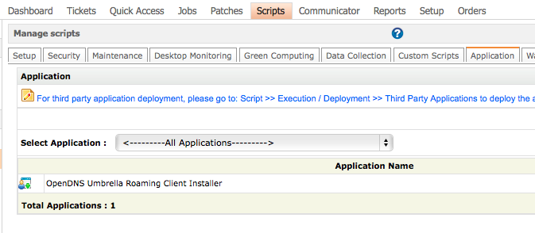
			</td>
		</tr>
	</tbody>
</table>

- - -


Now that you’ve created this application deployment script, you can use the Real-time Deployment option or Agent Next Check-in Deployment to deploy.  OpenDNS recommends testing your script on a single machine to verify it works as expected before deploying to a large group. In the Scripts Home, find the Third Party applications section on the left navigation pane as shown below.

<table style="width:100%">
	<tbody>
		<tr>
			<td>
				 Third Party Applications" style="vertical-align:middle">
			</td>
		</tr>
	</tbody>
</table>

If using the Real-time Deployment screen, choose the “Install from Download Site” option. 

<table style="width:100%">
	<tbody>
		<tr>
			<td>
				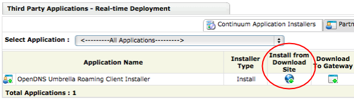
			</td>
		</tr>
	</tbody>
</table>

Additionally, you can look at the installation options by clicking the Options icon.  Your screen should look similar to this:

<table style="width:100%">
	<tbody>
		<tr>
			<td>
				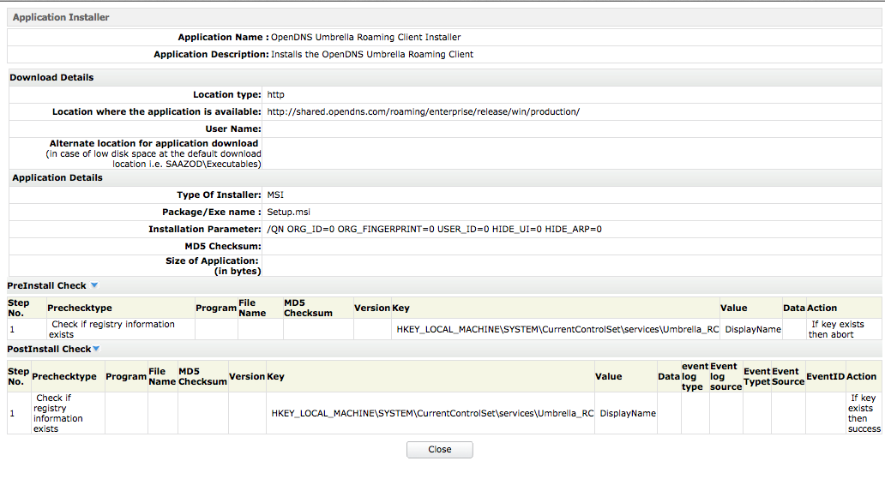
			</td>
		</tr>
	</tbody>
</table>

You can choose to install based on destination client OS and Service Pack. Use this filter to prevent deployment to servers.  Note: Some partners have found that selecting individual systems is more accurate for choosing only clients and not servers.

<table style="width:100%">
	<tbody>
		<tr>
			<td>
				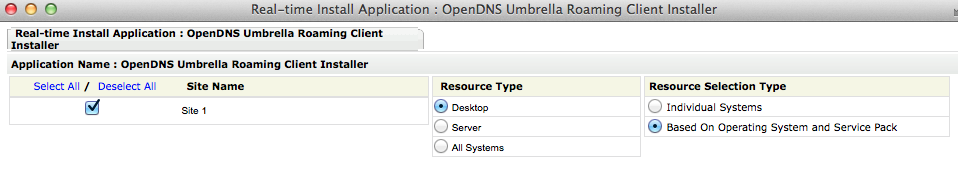
			</td>
		</tr>
	</tbody>
</table>

On the next screen, choose the Windows Operating System you want to filter with, and then select all appropriate workstations to deploy the Roaming Client to:

<table style="width:100%">
	<tbody>
		<tr>
			<td>
				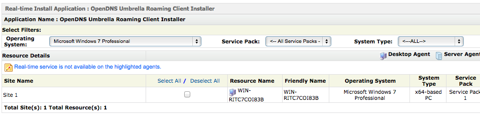
			</td>
		</tr>
	</tbody>
</table>

If you have configured the Pre-Install check, you’ll notice the following notification on workstations that have the Roaming Client installed already:

<table style="width:100%">
	<tbody>
		<tr>
			<td>
				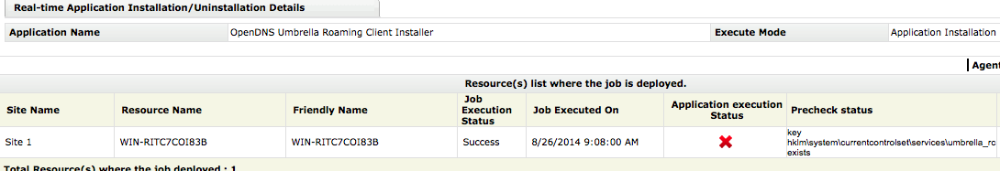
			</td>
		</tr>
	</tbody>
</table>

If you have configured the Post-Install check, you’ll see the following status notifications based on the Post-Install check:

<table style="width:100%">
	<tbody>
		<tr>
			<td style="align:center">
				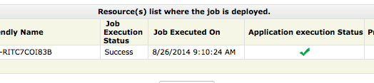
			</td>
		</tr>
		<tr>
			<td>
			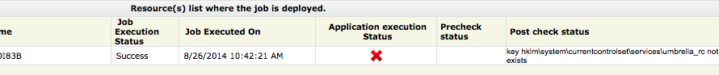
			</td>
		</tr>
	</tbody>
</table>

To confirm the Roaming Client is checking in, log into your OpenDNS Dashboard and choose the customer where you ran the deployment script.  Then navigate to Configuration > Identities > Roaming Computers.  If the computer is checking in properly, you’ll notice a green status icon as shown below.  

<table style="width:100%">
	<tbody>
		<tr>
			<td>
				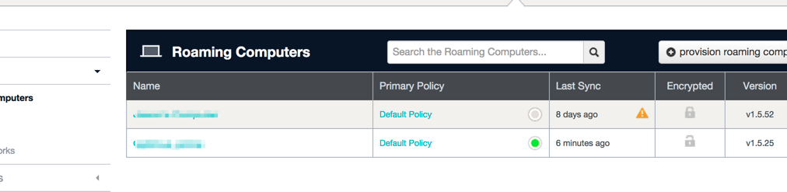
			</td>
		</tr>
	</tbody>
</table>

Computers without a green status icon are not checking in properly with OpenDNS.  Please check [this support article](https://support.opendns.com/entries/22182631) for more information on the status icons and troubleshooting.
