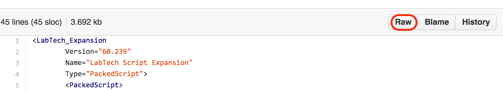
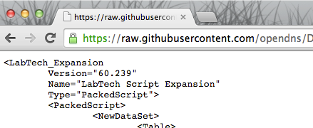
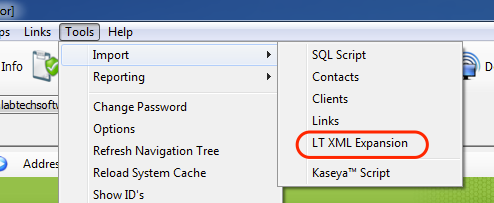
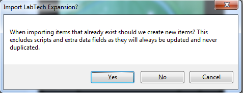
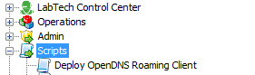
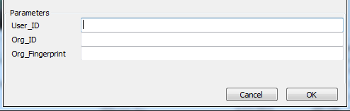
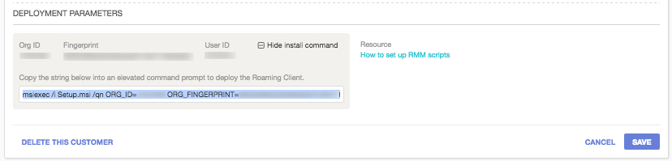
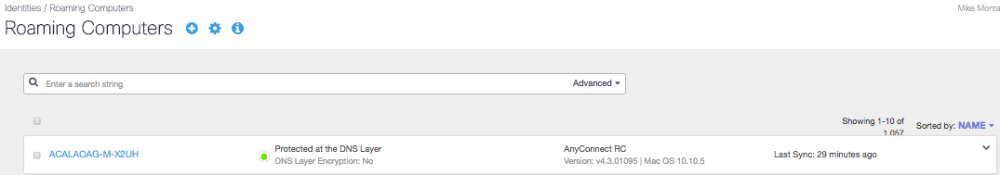

###Deploying OpenDNS Umbrella Roaming Client with LabTech
<div>
<table style="height: 100px; width: 100%">
	<tbody>
		<tr>
			<td bgcolor="#ffffcc">
				<p><strong>NOTE:</strong> This document is specific to deploying the OpenDNS Roaming Client on Windows client operating systems,  such as Windows 8 or 10. OpenDNS does not support the installation of the Roaming Client on Windows Server operating systems.</p>
			</td>
		</tr>
	</tbody>
</table>
</div>


The OpenDNS Roaming Client can be deployed using RMM tools, such as LabTech, by applying the <a href="https://support.opendns.com/entries/55881150-Roaming-Client-Deployment-Parameters-for-mass-deployment-MSP-">correct parameters</a> as part of the install string.  

Our <a href="https://github.com/opendns/Deploy-Scripts/tree/master/Labtech">basic script</a> outlined in this readme prompts for the values to be used when deploying the Roaming Client. If you are looking for a more advanced and automated integration, please see our advanced script located <a href="https://github.com/opendns/Deploy-Scripts/tree/master/Labtech/advanced">here</a>. 

<div>
<table style="align:center"><colgroup><col width="624" /></colgroup>
	<tbody>
		<tr>
			<td bgcolor="#ccffff">This document assumes that you have read the prerequisites for the Roaming Client and all necessary firewall ports have been opened as documented in <a href="https://support.opendns.com/entries/22198613">this support article.</a>  Please note that all customer Internal Domains must be entered first before deploying the Roaming Client.  Failure to do so will cause problems with accessing internal resources. This is done in the Dashboard by navigating to Configuration > System Settings > Internal Domains. For details about what needs to be in this list, please see <a href="https://support.opendns.com/entries/22365052">this support article</a>.
			</td>
		</tr>
	</tbody>
</table>
</div>

For those not familiar with GitHub, to import the script properly click on the name of the script in GitHub, and then click on the ‘Raw’ button as shown below:

<table style="width:100%">
	<tbody>
		<tr>
			<td>
				 Raw">
			</td>
		</tr>
	</tbody>
</table>

This will open the script into raw XML (see below) that you can copy/paste into your favorite text editor and save as an XML file.

<table>
	<tbody>
		<tr>
			<td>
				
			</td>
		</tr>
	</tbody>
</table>

Once you have the file saved, now we can import into LabTech.  To do that, open the LabTech Control Center, and click on Tools > Import > LT XML Expansion.

<table style="width:100%">
	<tbody>
		<tr>
			<td>
				
			</td>
		</tr>
	</tbody>
</table>

You will be warned that importing items that already exist will result in them being updated, not new items created.  You can click ‘Yes’ on this warning.

<table style="width:100%">
	<tbody>
		<tr>
			<td>
				
			</td>
		</tr>
	</tbody>
</table>

Now you should see the newly imported script in the root script folder, and you can move it to your preferred location.

<table style="width:100%">
	<tbody>
		<tr>
			<td>
				<center></center>
			</td>
		</tr>
	</tbody>
</table>

When running the script, you will be prompted to enter the <a href="https://support.opendns.com/entries/55881150-Roaming-Client-Deployment-Parameters-for-mass-deployment-MSP-">parameters</a> found in the MSP Console.  

<table style="width:100%">
	<tbody>
		<tr>
			<td>
				
			</td>
		</tr>
	</tbody>
</table>

The ```User_ID```, ```Org_ID``` and ```Org_Fingerprint``` parameters are found in the MSP Console under the Customer Management card in the _Deployment Parameters_ section.  

<table style="width:100%">
	<tbody>
		<tr>
			<td>
				
			</td>
		</tr>
	</tbody>
</table>

To confirm the Roaming Client is checking in, log into your OpenDNS Dashboard and choose the customer where you ran the deployment script.  Then navigate to Configuration -> Identities -> Roaming Computers.  If the computer is checking in properly, you’ll notice a green status icon as shown below.  

<table style="width:100%">
	<tbody>
		<tr>
			<td>
				
			</td>
		</tr>
	</tbody>
</table>

Computers without a green status icon are not checking in properly with OpenDNS.  Please check [this support article](https://support.opendns.com/entries/22182631) for more information on the status icons and troubleshooting.
