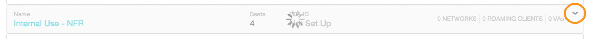

### Deploying Umbrella roaming client with LabTech
<div>
<table style="height: 100px; width: 100%">
	<tbody>
		<tr>
			<td bgcolor="#ffffcc">
				<p><strong>NOTE:</strong> This document is specific to deploying the Cisco Umbrella roaming client on Windows client operating systems, such as Windows 8 or 10. We do not support the installation of the Umbrella roaming client on Windows Server operating systems. A complete list of prerequisites are available <a href="https://docs.umbrella.com/product/msp/prerequisites/">here</a>. This document assumes you've read these prerequisites and have opened the appropriate firewall ports.</p>
			</td>
		</tr>
	</tbody>
</table>
</div>


The Umbrella roaming client can be deployed using RMM tools, such as LabTech, by applying the <a href="https://docs.umbrella.com/product/msp/automated-deployment/#section-deployment-parameters">correct parameters</a> as part of the install string.  

The basic script outlined in this document prompts for the values to be used when deploying the Roaming Client. If you are looking for a more advanced and automated integration, please see our advanced script located <a href="https://github.com/opendns/Deploy-Scripts/tree/master/Labtech/advanced">here</a>. 

<div>
<table style="align:center"><colgroup><col width="624" /></colgroup>
	<tbody>
		<tr>
			<td bgcolor="#ccffff">You must enter all customer internal domains before deploying the Umbrella roaming client. Failure to do so will cause problems with accessing internal resources. To do this, in the Umbrella dashboard navigate to Settings > Internal Domains and enter domains as required. For details about what needs to be in this list, please see  <a href="https://docs.umbrella.com/product/msp/appendix-d-internal-domains/">this support article</a>.
			</td>
		</tr>
	</tbody>
</table>
</div>

To download the script, you can find the [full script here](https://github.com/opendns/Deploy-Scripts/blob/master/Labtech/Deploy_Umbrella_Client.xml).
If you aren't familiar with GitHub, we recommend importing the script properly by clicking <strong>Raw</strong>.

<table style="width:100%">
	<tbody>
		<tr>
			<td>
				 Raw">
			</td>
		</tr>
	</tbody>
</table>

This will open the script into raw XML (see below) that you can copy/paste into your favorite text editor and save as an XML file.

<table>
	<tbody>
		<tr>
			<td>
				
			</td>
		</tr>
	</tbody>
</table>

Once you have the file saved, now we can import into LabTech.  To do that, open the LabTech Control Center, and click on Tools > Import > LT XML Expansion.

<table style="width:100%">
	<tbody>
		<tr>
			<td>
				
			</td>
		</tr>
	</tbody>
</table>

You will be warned that importing items that already exist will result in them being updated, not new items created.  You can click ‘Yes’ on this warning.

<table style="width:100%">
	<tbody>
		<tr>
			<td>
				
			</td>
		</tr>
	</tbody>
</table>

Now you should see the newly imported script in the root script folder, and you can move it to your preferred location.

<table style="width:100%">
	<tbody>
		<tr>
			<td>
				<center></center>
			</td>
		</tr>
	</tbody>
</table>

When running the script, you will be prompted to enter the <a href="https://docs.umbrella.com/product/msp/automated-deployment/#section-deployment-parameters">parameters</a> found in the MSP Console.  

<table style="width:100%">
	<tbody>
		<tr>
			<td>
				
			</td>
		</tr>
	</tbody>
</table>

In the Umbrella for MSPs Console, you can find the ```User_ID```, ```Org_ID``` and ```Org_Fingerprint``` parameters by navigating to Customer Management and expanding a customer.
<table>
	<tbody>
		<tr>
			<td>
				
			</td>
		</tr>
	</tbody>
</table>
The parameters are located in the _Deployment Parameters_ area.  

<table style="width:100%">
	<tbody>
		<tr>
			<td>
				
			</td>
		</tr>
	</tbody>
</table>

To confirm the roaming client is checking in, log into your Umbrella Dashboard and choose the customer where you ran the deployment script. Navigate to Identities > Roaming Computers, and search for the individual host names where the script should have been run.  If the computer is checking in properly, you’ll notice a green status icon as shown below:  
<table style="width:100%">
	<tbody>
		<tr>
			<td>
				
			</td>
		</tr>
	</tbody>
</table>

Computers without a green status icon are not checking in properly with Umbrella.  Please check [this support article](https://docs.umbrella.com/product/msp/appendix-a-status-and-functionality/) for more information on the status icons and troubleshooting.
