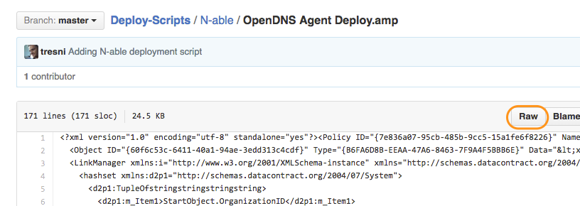
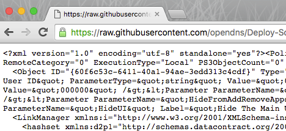
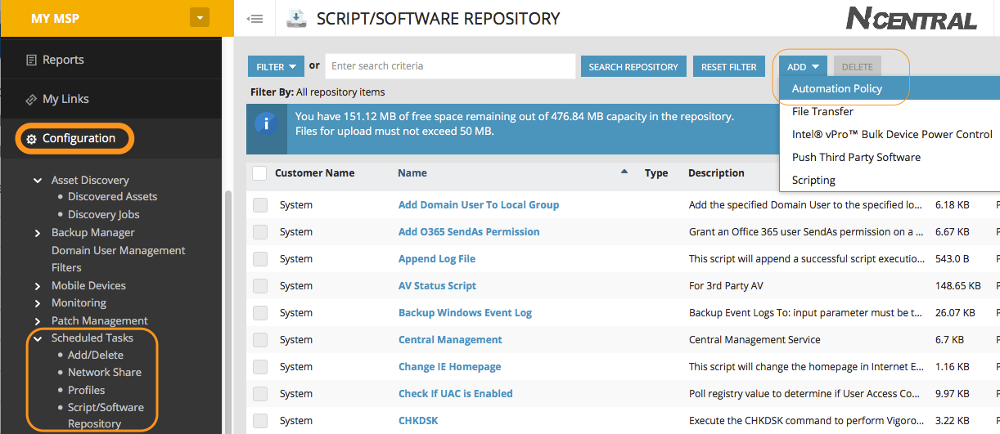
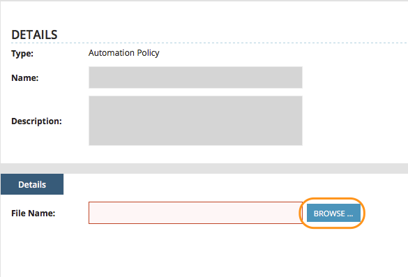
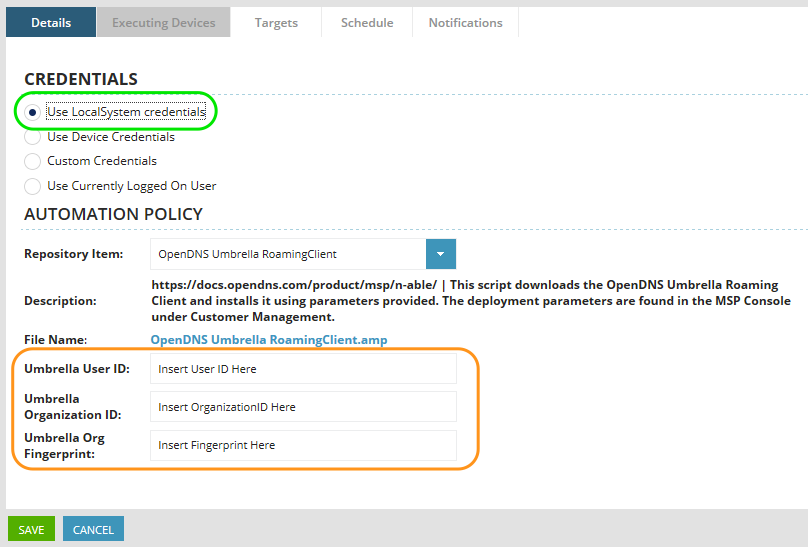
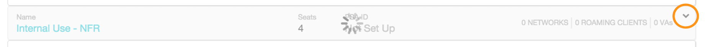
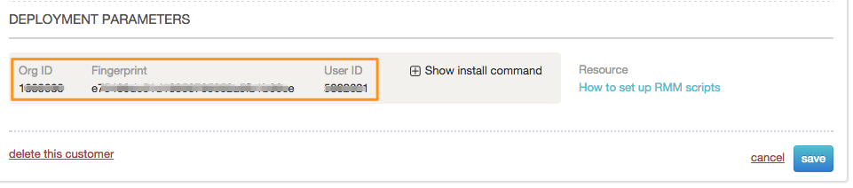
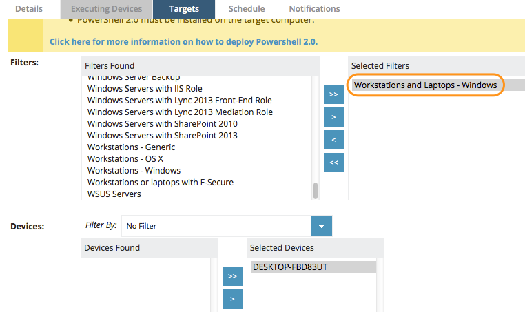
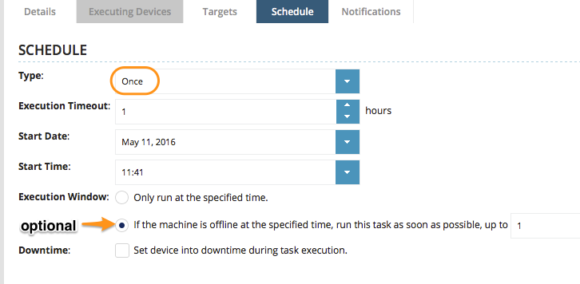
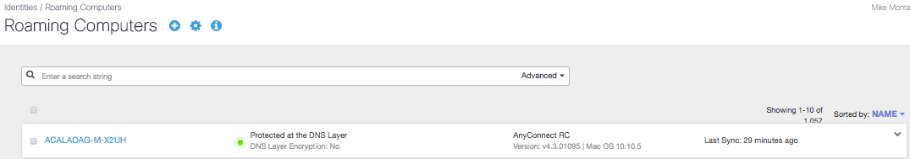

###Deploying OpenDNS Umbrella Roaming Client with N-able
<div>
<table style="height: 100px; width: 100%">
	<tbody>
		<tr>
			<td bgcolor="#ffffcc">
				<p><strong>NOTE:</strong> This document is specific to deploying the OpenDNS Roaming Client on Windows client operating systems,  such as Windows 8 or 10. OpenDNS does not support the installation of the Roaming Client on Windows Server operating systems.</p>
			</td>
		</tr>
	</tbody>
</table>
</div>


The OpenDNS Roaming Client can be deployed using RMM tools, such as N-able, by applying the <a href="https://docs.opendns.com/product/msp/automated-deployment/#section-deployment-parameters">correct parameters</a> as part of the install string.  


<div>
<table style="align:center"><colgroup><col width="624" /></colgroup>
	<tbody>
		<tr>
			<td bgcolor="#ccffff">This document assumes that you have read the prerequisites for the Roaming Client and all necessary firewall ports have been opened as documented in <a href="https://docs.opendns.com/product/msp/prerequisites/">this support article.</a>  Please note that all customer Internal Domains must be entered first before deploying the Roaming Client.  Failure to do so will cause problems with accessing internal resources. This is done in the Dashboard by navigating to Configuration > System Settings > Internal Domains. For details about what needs to be in this list, please see <a href="https://docs.opendns.com/product/msp/appendix-d-internal-domains/">this support article</a>.
			</td>
		</tr>
	</tbody>
</table>
</div>

To download the script, you can find the [full script here](https://github.com/opendns/Deploy-Scripts/blob/master/N-able/UmbrellaRoamingClient-install.amp).
If you aren't familiar with GitHub, we recommend importing the script properly by clicking on the ‘Raw’ button as shown below:

<table style="width:100%">
	<tbody>
		<tr>
			<td>
				 Raw">
			</td>
		</tr>
	</tbody>
</table>

This will open the script into raw XML (see below) that you can copy/paste into your favorite text editor and save as a .AMP file.

<table>
	<tbody>
		<tr>
			<td>
				
			</td>
		</tr>
	</tbody>
</table>

Once you have the file saved, now we can import into N-able.  To do that, at the Service Organization (SO) level, navigate to Configuration > Scheduled Tasks > Script/Software Repository. Here you can add a new automation policy:

<table style="width:100%">
	<tbody>
		<tr>
			<td>
				
			</td>
		</tr>
	</tbody>
</table>

Choose the file to upload, and then click "OK."

<table style="width:100%">
	<tbody>
		<tr>
			<td>
				
			</td>
		</tr>
	</tbody>
</table>

To schedule the Automation Policy, navigate to the appropriate customer and click on Actions > Run an Automation Policy. Select "OpenDNS Umbrella RoamingClient"  and you will see the screen below. You will be need to enter the <a href="https://docs.opendns.com/product/msp/automated-deployment/#section-deployment-parameters">parameters</a> found in the MSP Console.  

<div>
<table style="height: 10px; width: 100%">
	<tbody>
		<tr>
			<td bgcolor="#ffffcc">
				<p><strong>NOTE:</strong> OpenDNS recommends using the LocalSystem credentials as shown below.</p>
			</td>
		</tr>
	</tbody>
</table>
</div>

<table style="width:100%">
	<tbody>
		<tr>
			<td>
				
			</td>
		</tr>
	</tbody>
</table>

<div>
<table style="height: 10px; width: 100%">
	<tbody>
		<tr>
			<td bgcolor="#ccffff">
				<p><strong>Support Operating Systems:</strong><br>This script will exit if a Windows Server operating system is detected, as it is not supported.</p>
			</td>
		</tr>
	</tbody>
</table>
</div>

By default, this install will hide the Add/Remove Programs entry, as well as the Windows system tray icon.

The ```User_ID```, ```Org_ID``` and ```Org_Fingerprint``` parameters are found in the MSP Console under the Customer Management card in the _Deployment Parameters_ section.  
<table>
	<tbody>
		<tr>
			<td>
				
			</td>
		</tr>
	</tbody>
</table>

<table style="width:100%">
	<tbody>
		<tr>
			<td>
				
			</td>
		</tr>
	</tbody>
</table>

Next, select the target workstations to install the roaming client on:

<div>
<table style="height: 100px; width: 100%">
	<tbody>
		<tr>
			<td bgcolor="#ffffcc">
				<p><strong>NOTE:</strong> The OpenDNS Roaming Client is only supported on Windows client operating systems,  such as Windows 8 or 10. OpenDNS does not support the installation of the Roaming Client on Windows Server operating systems.</p>
			</td>
		</tr>
	</tbody>
</table>
</div>

<table style="width:100%">
	<tbody>
		<tr>
			<td>
				
			</td>
		</tr>
	</tbody>
</table>

After you've selected your workstations to deploy the Roaming Client to, you will need to set the schedule. You can use a one-time schedule since the Roaming Client will auto-update. In N-able, you have the option to run the task later on offline workstations.

<table style="width:100%">
	<tbody>
		<tr>
			<td>
				
			</td>
		</tr>
	</tbody>
</table>

After running the automation policy, you can confirm the Roaming Client is checking in by logging into your OpenDNS Dashboard and choose the customer where you ran the deployment script.  Then navigate to Configuration -> Identities -> Roaming Computers.  If the computer is checking in properly, you’ll notice a green status icon as shown below.  

<table style="width:100%">
	<tbody>
		<tr>
			<td>
				
			</td>
		</tr>
	</tbody>
</table>

Computers without a green status icon are not checking in properly with OpenDNS.  Please check [this support article](https://docs.opendns.com/product/msp/appendix-a-status-and-functionality/) for more information on the status icons and troubleshooting.
