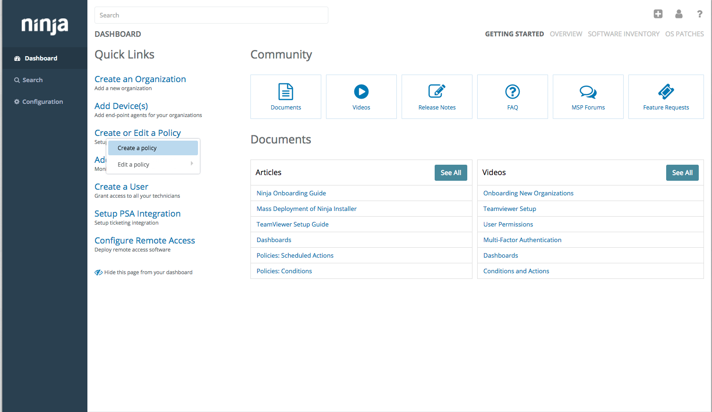
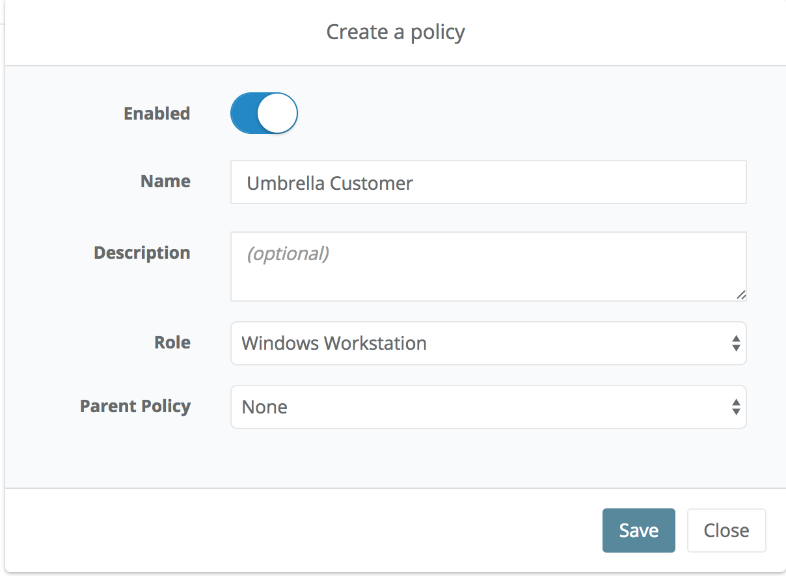
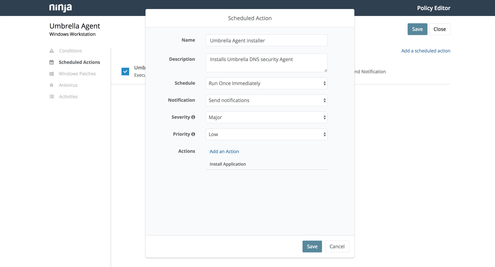
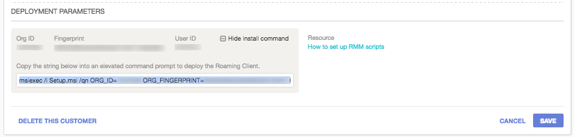
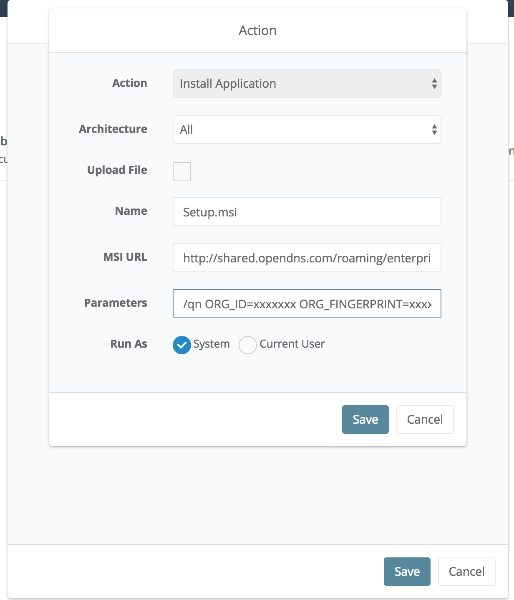
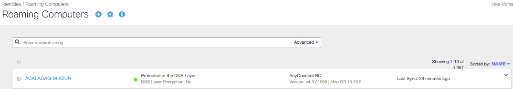

### Deploying Umbrella roaming client with Ninja

<table style="height: 50px; width: 100%">
	<tbody>
		<tr>
			<td bgcolor="#ffffcc">
				
 This guide is meant to be a basic overview of deploying the Cisco Umbrella roaming client using your RMM tool. We are not able to provide comprehensive support for Ninja, but there is  <a href="https://ninjarmm.zendesk.com/hc/en-us/categories/200886343-Documents">further documentation</a> available related to deployment in Ninja.

			</td>
		</tr>
	</tbody>
</table>

<table style="height: 100px; width: 100%">
	<tbody>
		<tr>
			<td bgcolor="#ffffcc">
				
<strong>NOTE:</strong> This document is specific to deploying the Umbrella roaming client on Windows client operating systems, such as Windows 8 or 10. We do not support the installation of the Umbrella roaming client on Windows Server operating systems. A list of prerequisites is available <a href="https://docs.umbrella.com/product/msp/prerequisites/">here</a>. This document assumes you've read these prerequisistes and have opened the appropriate firewall ports

			</td>
		</tr>
	</tbody>
</table>

Ninja provides the ability to create Scheduled Actions to deploy products that are not built-in to Ninja’s RMM tool.  This document provides the instructions to add a Scheduled Action to your Polcies to deploy the Umbrella roaming client to your customer's computers. You will need to create a Scheduled Action that is unique to each customer. We recommend creating a Scheduled Action/Policy for each individual customer with a naming convention such as %Client Name% Umbrella roaming client Deployment. This will allow easy deployment to customers in the future and allow scheduling of installs.

<table style="align:center"><colgroup><col width="624" /></colgroup>
	<tbody>
		<tr>
			<td bgcolor="#ccffff">You must enter all customer internal domains before deploying the Umbrella roaming client. Failure to do so will cause problems with accessing internal resources. To do this, in the Umbrella dashboard, navigate to Settings > Internal Domains and enter domains as required. For details about what needs to be in this list, please see please see <a href="https://docs.umbrella.com/product/msp/appendix-d-internal-domains/">this support article</a>.
			</td>
		</tr>
	</tbody>
</table>

Once logged into your Ninja Dashboard, navigate to Create or Edit a Policy and choose either Create a policy or Edit a policy, in this example we are going to choose Create a policy. However if you did choose the Edit a Policy you would want to choose the relevant policy for the customer and then the steps should be the same. 

<table style="width:100%">
	<tbody>
		<tr>
			<td>
				
			</td>
		</tr>
	</tbody>
</table>

Once in the Create a policy wizard, name the policy and choose the Role to be `Windows Workstation` and save the new policy. 

<table style="align:center"><colgroup><col width="624" /></colgroup>
    <tbody>
        <tr>
            <td bgcolor="#ccffff">NOTE: Depending on your policy layout, you can use the `Parent Policy` field to link this to an existing policy. However, please note that the  variables are unique per customer, so linking to the wrong policy could result in roaming client in in the wrong customer organization.
            </td>
        </tr>
    </tbody>
</table>

<table style="width:50%">
	<tbody>
		<tr>
			<td>
				
			</td>
		</tr>
	</tbody>
</table>

Now that you are in the Policy Editor you will need to create a `Scheduled Action`, set the parameters as desired and then choose the Action to be `Install Application`.

<table style="width:75%">
	<tbody>
		<tr>
			<td>
				
			</td>
		</tr>
	</tbody>
</table>

--

### In the new section you will want to do the following

Name: `Setup.msi`  _(note this is case-sensitive)_

MSI URL: `https://cisco-umbrella-client-downloads.s3.amazonaws.com/win/production/`

_Note that this URL does not work in a browser unless you include the filename `Setup.msi` in the URL. This location tells Continuum where to look for the file, and below we'll be setting the filename._

Installation Parameter: _Use string from Customer Management shown below_

<table style="align:center"><colgroup><col width="624" /></colgroup>
	<tbody>
		<tr>
			<td>
				
			</td>
		</tr>
  </tbody>
</table>

<table style="height: 70px; width: 100%">
	<tbody>
		<tr>
			<td bgcolor="#ffffcc">
				<strong>NOTE:</strong> If you want a visible installation, you can change the HIDE_UI and HIDE_ARP to 0 instead of 1; more details about this and the other variables are available in <a href="https://docs.umbrella.com/product/msp/automated-deployment/#section-deployment-parameters">this support article</a>.
			</td>
		</tr>
	</tbody>
</table>

Run As: `System`

You should end up with something that looks like this:

<table style="align:center"><colgroup><col width="624" /></colgroup>
	<tbody>
		<tr>
			<td>
				
			</td>
		</tr>
  </tbody>
</table>

- - -

To confirm the roaming client is checking in, log into your Umbrella Dashboard and choose the customer where you ran the deployment script. Navigate to Identities > Roaming Computers, and search for the individual host names where the script should have been run.  If the computer is checking in properly, you’ll notice a green status icon as shown below:  

<table style="width:100%">
	<tbody>
		<tr>
			<td>
				
			</td>
		</tr>
	</tbody>
</table>

Computers without a green status icon are not checking in properly with Umbrella.  Please check [this support article](https://docs.umbrella.com/product/msp/appendix-a-status-and-functionality/) for more information on the status icons and troubleshooting.

---
